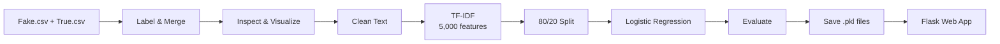

# TruthLens: Fake News Detection using NLP & Machine Learning

## Project Overview

Misinformation continues to challenge the credibility of digital media, and checking every article by hand is not practical. **TruthLens** addresses this with a machine learning pipeline that reads the text of a news article and predicts whether it is **Real** (authentic) or **Fake** (fabricated).

The project covers the full workflow, from raw text to a working application:

1. Loading and labelling two news datasets
2. Checking data quality (shape, data types, missing values)
3. Visualizing the class distribution
4. Cleaning the text
5. Converting text into numerical features with TF-IDF
6. Training and evaluating a Logistic Regression classifier
7. Saving the model and vectorizer
8. Serving predictions through a Flask web app with an HTML interface

## Objectives

- Build a supervised model that classifies news articles as real or fake from their text
- Turn raw text into numerical features using TF-IDF
- Evaluate the model with accuracy, precision, recall, and F1-score
- Save the trained model and vectorizer so predictions can be made without retraining
- Make the model usable through a simple web interface

## Dataset

The data comes from **Kaggle** and consists of two CSV files that were combined into one labelled dataset:

| File | Content | Label assigned |
|------|---------|----------------|
| `Fake.csv` | Fake news articles | `0` |
| `True.csv` | Real news articles | `1` |

**Columns**

| Column | Description |
|--------|-------------|
| `title` | Article headline |
| `text` | Article body (**the feature used for modelling**) |
| `subject` | Subject of the article |
| `date` | Publication date |
| `label` | Target variable (0 = Fake, 1 = Real), added during preprocessing |

**Summary**

- **Total articles:** 44,898
- **Class split:** about 23,481 fake and 21,417 real, so the classes are fairly balanced
- **Missing values:** none in any column
- **Train / test split:** 35,918 training and 8,980 test articles (80/20)

> **Note:** The data files are not included in this repository. To retrain the model, place `Fake.csv` and `True.csv` in a `data/` folder.

## Methodology



### 1. Load and label the data
Both files were loaded with Pandas. Fake articles were labelled `0`, real articles `1`, and the two sets were merged.

```python
fake["label"] = 0
real["label"] = 1
data = pd.concat([fake, real])
```

### 2. Inspect the data
`data.shape`, `data.info()`, and `data.isnull().sum()` confirmed the size, column types, and that no values were missing.

### 3. Explore the class balance
A bar chart of the `label` counts ("Fake vs Real News") was plotted with Matplotlib.

### 4. Clean the text
Text was converted to lowercase, and everything except letters and spaces was removed.

```python
def clean_text(text):
    text = text.lower()
    text = re.sub(r'[^a-zA-Z ]', '', text)
    return text

data["text"] = data["text"].apply(clean_text)
```

### 5. Extract features
The cleaned text was converted into a TF-IDF matrix using the 5,000 most informative terms.

```python
vectorizer = TfidfVectorizer(max_features=5000)
X = vectorizer.fit_transform(data["text"])
y = data["label"]
```

### 6. Split the data and train the model
The data was split 80/20, and a Logistic Regression model with default scikit-learn settings was trained.

```python
X_train, X_test, y_train, y_test = train_test_split(X, y, test_size=0.2)
model = LogisticRegression()
model.fit(X_train, y_train)
```

### 7. Evaluate the model
Predictions on the test set were scored with `accuracy_score` and `classification_report`.

### 8. Save the model
The trained model and the fitted vectorizer were saved to `models/` with `pickle`. Saving both together makes sure new text is converted with the same vocabulary and weights used in training.

### 9. Build the web app
A Flask app loads both files, converts the user's input into features, and shows the prediction on an HTML page.

## Statistical & Analytical Methods

| Technique | Purpose |
|-----------|---------|
| **Text normalization** (lowercasing, regex filtering) | Reduces noise before vectorization |
| **TF-IDF** (Term Frequency–Inverse Document Frequency) | Gives more weight to words that are distinctive to a document and less to words that are common everywhere |
| **Vocabulary limit** (`max_features=5000`) | Keeps the 5,000 most informative terms to control dimensionality |
| **Logistic Regression** | Linear binary classifier that estimates the probability that an article is real (scikit-learn defaults, L2 regularization) |
| **Hold-out validation** (80/20) | Estimates performance on data the model has not seen |
| **Evaluation metrics** | Accuracy, precision, recall, F1-score, and support for each class |
| **Exploratory data analysis** | Class-distribution chart and missing-value check |

## Key Findings & Results

The model was tested on **8,980** unseen articles:

| Class | Precision | Recall | F1-Score | Support |
|-------|-----------|--------|----------|---------|
| Fake (0) | 0.99 | 0.99 | 0.99 | 4,588 |
| Real (1) | 0.99 | 0.99 | 0.99 | 4,392 |
| **Accuracy** | | | **0.99** | **8,980** |
| Macro avg | 0.99 | 0.99 | 0.99 | 8,980 |
| Weighted avg | 0.99 | 0.99 | 0.99 | 8,980 |

**Overall test accuracy: 99.03%**

**What this means**

- **Precision of 0.99:** when the model labels an article as fake (or real), it is right about 99% of the time.
- **Recall of 0.99:** the model finds about 99% of all fake and all real articles in the test set.
- **Balanced results:** both classes score the same, so the model does not favour one over the other. This matches the near-even class split.

## Key Outcomes

- Built a complete machine learning pipeline, from raw text to a live prediction in a web app
- Connected a trained scikit-learn model to a Flask application with an interactive HTML interface
- Reached 99.03% accuracy, with precision, recall, and F1-score of 0.99 for both classes
- Checked class balance and identified model generalization and data source as areas for further testing (see [Limitations](#limitations--considerations))

## Web Application

The Flask app (`app.py`) serves one page at `/` that handles both GET and POST requests.

```python
vect = vectorizer.transform([news])
pred = model.predict(vect)
prediction = "Real News ✅" if pred[0] == 1 else "Fake News ❌"
```

**Interface features** (`templates/index.html`)

- Text box for pasting a headline or full article
- Live character counter (turns red above 2,000 characters)
- **Analyze Now** button with a loading state
- Colour-coded result card showing **Real News Detected** or **Fake News Detected**
- "How it works" section explaining the input, vectorization, and prediction steps

## Tools & Technologies

| Category | Tools |
|----------|-------|
| Language | Python |
| Data handling | Pandas |
| NLP / ML | scikit-learn (`TfidfVectorizer`, `LogisticRegression`, `train_test_split`, `accuracy_score`, `classification_report`) |
| Visualization | Matplotlib |
| Text processing | `re` (regular expressions) |
| Model saving | `pickle` |
| Web framework | Flask (Jinja2 templates) |
| Frontend | HTML, CSS, JavaScript |
| Environment | Jupyter Notebook, Git/GitHub |

## Project Structure

```
TruthLens/
├── app.py                    # Flask app (loads model, serves predictions)
├── models/
│   ├── fake_news_model.pkl   # Trained Logistic Regression model
│   └── vectorizer.pkl        # Fitted TF-IDF vectorizer (5,000 features)
├── notebooks/
│   └── project.ipynb         # Analysis, training, and evaluation
├── templates/
│   └── index.html            # Web interface
├── data/                     # Fake.csv and True.csv (not included; add to retrain)
└── README.md
```

## How to Run

### 1. Clone the repository

```bash
git clone https://github.com/nullorigin1/TruthLens.git
cd TruthLens
```

### 2. (Recommended) Create a virtual environment

```bash
python -m venv venv
# Windows
venv\Scripts\activate
# macOS / Linux
source venv/bin/activate
```

### 3. Install dependencies

```bash
pip install flask scikit-learn pandas matplotlib jupyter
```

> The included model files were saved with scikit-learn 1.7.2. Using the same version avoids compatibility warnings.

### 4. Run the web app

```bash
python app.py
```

Open the address shown in the terminal (Flask default: `http://127.0.0.1:5000`), paste a news article or headline, and click **Analyze Now**.

### 5. (Optional) Retrain the model

1. Add `Fake.csv` and `True.csv` to the `data/` folder.
2. Update the file paths in the first cell of `notebooks/project.ipynb`.
3. Run all cells in order. The notebook saves the new model and vectorizer to `models/`.

## Limitations & Considerations

- **Single hold-out split:** results come from one 80/20 split with no fixed random seed, so exact numbers may vary slightly between runs.
- **Vectorizer fitted on all data:** TF-IDF was fitted before the train/test split. Fitting it on the training set only would give a stricter test.
- **One data source:** the model was trained and tested on a single dataset, so its performance on articles from other sources or time periods has not been measured.
- **Text-only features:** only the article body is used; `title`, `subject`, and `date` are not part of the model.

## Conclusion

TruthLens demonstrates a complete NLP classification workflow, from raw text to a working web application. A simple, interpretable pipeline of text cleaning, TF-IDF vectorization, and Logistic Regression reached **99.03% accuracy** with balanced precision and recall across both classes. Serving the model through Flask makes it easy for anyone to try, with no coding required.

## Future Scope

**In progress / planned**

- Upgrade to transformer-based models such as **BERT**
- Improve the user interface
- Integrate **real-time news feeds**

**Further ideas**

- Use a fixed random seed and stratified splitting for reproducible results
- Fit the vectorizer on training data only
- Apply k-fold cross-validation for a more reliable performance estimate
- Compare other classifiers (e.g., Naive Bayes, SVM, Random Forest) with the Logistic Regression baseline
- Add stop-word removal, n-grams, or lemmatization
- Use the `title` and `subject` fields as extra features
- Report a confusion matrix and ROC–AUC
- Test on news from other sources to measure generalization
- Add a `requirements.txt` and host the app online

## Feedback & Collaboration

Feedback, suggestions, and discussions about AI applications in media integrity are welcome. Feel free to open an issue or get in touch.

---

## Author

**Jamil Mahida**

